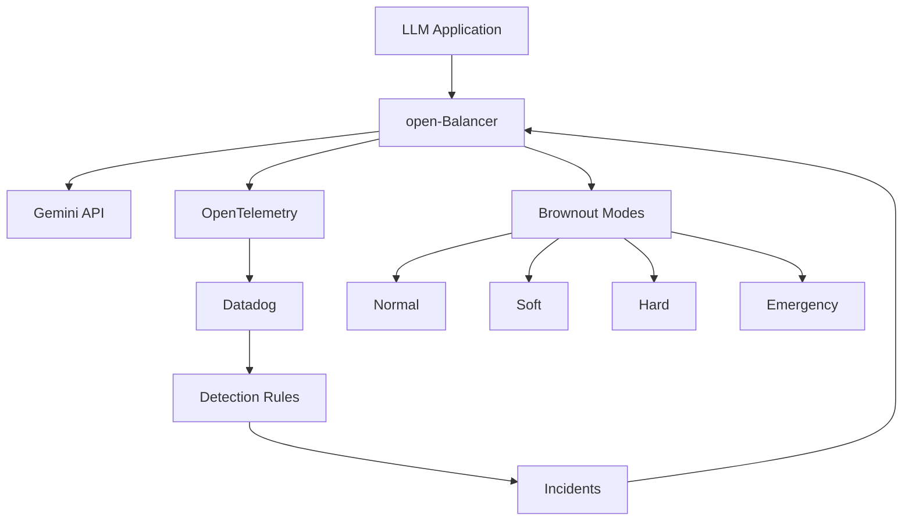

# open-Balancer

[](https://opensource.org/licenses/MIT)
[](https://typescriptlang.org/)
[](https://nextjs.org/)
[](https://cloud.google.com/)
[](https://www.datadoghq.com/)

An open-source adaptive control layer for Gemini-powered LLM applications that maintains reliability and cost efficiency under stress.

## 🎯 Overview

open-Balancer brings proven SRE "brownout" principles to AI systems, automatically applying adaptive strategies when your LLM applications face stress. Using real-time signals from Datadog, it gracefully reduces response complexity when latency, error rates, or token costs spike—keeping applications responsive instead of failing.

### Key Benefits

- **🔄 Real-time Adaptation**: Automatically adjusts LLM behavior based on live monitoring signals
- **💰 Cost Control**: Reduces token usage when costs spike, maintaining budget predictability  
- **🛡️ Reliability First**: Prevents sudden degradation with graceful brownout strategies
- **📊 Deep Observability**: Built-in integration with Datadog for comprehensive monitoring
- **☁️ Cloud Native**: Optimized for Google Cloud Platform with OpenTelemetry instrumentation
- **🎛️ Lightweight Console**: Monitor health, test behavior, and trace incidents

## 🏗️ Architecture



### Brownout Modes

1. **Normal Mode**: Full LLM capabilities, complex responses
2. **Soft Mode**: Slightly reduced complexity, faster responses
3. **Hard Mode**: Simplified responses, essential features only
4. **Emergency Mode**: Minimal responses, maximum reliability

## 🚀 Quick Start

### Prerequisites

- Node.js 18+ and npm
- Google Cloud Platform account
- Datadog account and API key
- Gemini API access

### Installation

1. **Clone the repository**
   ```bash
   git clone https://github.com/your-org/open-balancer.git
   cd open-balancer
   ```

2. **Install dependencies**
   ```bash
   npm install
   
   # Install backend dependencies
   pip install -r backend/requirements.txt

   ```

3. **Set up environment variables**
   ```bash
   cp .env.example .env.local
   # Edit .env.local with your configuration
   ```

4. **Run the development server**
   ```bash
   # Start external services (if not using cloud)
   # Start the backend (FastAPI)
   npm run backend
   
   # Start the frontend (Next.js) - in a new terminal
   npm run dev
   ```

5. **Open the console**
   Navigate to [http://localhost:3000/console/dashboard](http://localhost:3000/console/dashboard)

### Environment Configuration

```bash
# Google Cloud
GOOGLE_CLOUD_PROJECT=your-project-id
GOOGLE_APPLICATION_CREDENTIALS=path/to/service-account.json

# Gemini API
GEMINI_API_KEY=your-gemini-api-key

# Datadog
DATADOG_API_KEY=your-datadog-api-key
DATADOG_APP_KEY=your-datadog-app-key
DATADOG_SITE=datadoghq.com

# OpenTelemetry (Production-Grade Observability)
OTEL_SERVICE_NAME=open-balancer-backend
OTEL_EXPORTER_OTLP_ENDPOINT=https://otlp.datadoghq.com
OTEL_EXPORTER_OTLP_HEADERS="dd-api-key=your-datadog-api-key"
```

## 🔍 OpenTelemetry Integration (Recommended)

open-Balancer uses **OpenTelemetry** for production-grade observability with Datadog. This is the **official Datadog-supported** approach that works perfectly with Google Cloud Run.

### Why OpenTelemetry?

✅ **Official Datadog Support** - Fully supported by Datadog  
✅ **Cloud Run Compatible** - No host access needed  
✅ **Production-Grade** - Clean, modern instrumentation  
✅ **Application-Level** - Instruments your app, not the machine  
✅ **Complete Observability** - Traces, metrics, and logs  

### Windows PowerShell: Datadog Agent Installation (Optional)

If you want host-level metrics alongside OpenTelemetry, install the Datadog Agent:

```powershell
# Option 1: Direct MSI Installation
$env:DD_API_KEY="your-datadog-api-key"
$env:DD_SITE="us5.datadoghq.com"

# Download the installer
Invoke-WebRequest -Uri "https://s3.amazonaws.com/ddagent-windows-stable/datadog-agent-7-latest.amd64.msi" -OutFile "datadog-agent.msi"

# Install with your API key (Run PowerShell as Administrator)
Start-Process msiexec.exe -Wait -ArgumentList '/i datadog-agent.msi APIKEY="your-datadog-api-key" SITE="us5.datadoghq.com" /l*v datadog-install.log'

# Check installation
Get-Service | Where-Object {$_.DisplayName -like "*Datadog*"}
```

```powershell
# Option 2: One-liner Installation Script
$env:DD_API_KEY="your-datadog-api-key"; $env:DD_SITE="us5.datadoghq.com"; Set-ExecutionPolicy Bypass -Scope Process -Force; [System.Net.ServicePointManager]::SecurityProtocol = [System.Net.ServicePointManager]::SecurityProtocol -bor 3072; iex ((New-Object System.Net.WebClient).DownloadString('https://raw.githubusercontent.com/DataDog/datadog-agent/main/cmd/agent/install_script.ps1'))
```

**Note**: The Datadog Agent is optional since open-Balancer uses OpenTelemetry for telemetry data.

### Backend Setup (Python/FastAPI)

1. **Install OpenTelemetry Dependencies**
   ```bash
   pip install \
     opentelemetry-sdk \
     opentelemetry-exporter-otlp \
     opentelemetry-instrumentation-fastapi \
     opentelemetry-instrumentation-requests
   ```

2. **Configure Environment Variables**
   ```bash
   # Required for Datadog integration
   DD_API_KEY=your_datadog_api_key
   DD_SITE=datadoghq.com
   OTEL_SERVICE_NAME=open-balancer-backend
   OTEL_EXPORTER_OTLP_ENDPOINT=https://otlp.datadoghq.com
   OTEL_EXPORTER_OTLP_HEADERS="dd-api-key=your_datadog_api_key"
   ```

3. **Auto-Instrument Your Application**
   ```bash
   # Run with automatic instrumentation
   opentelemetry-instrument uvicorn main:app --host 0.0.0.0 --port 8080
   ```

4. **Verify Datadog Connection**
   - Navigate to **Datadog → APM → Services**
   - Look for `open-balancer-backend` service
   - "Waiting for agent" will disappear once traffic flows
   - Service becomes active with traces, metrics, and logs

## 🔍 Verify Telemetry Is Flowing (Critical Step)

**Before building features, confirm data is real** - this takes about 10 minutes:

### Check in Datadog Console:

1. **APM → Services**
   - You should see: `open-balancer-backend`
   - Status should show as "Active" with recent traces

2. **Metrics → Explorer**
   - Look for request count metrics: `trace.http.request`
   - Check latency metrics: `trace.http.request.duration`
   - Verify throughput: `trace.http.request.hits`

3. **Logs → Explorer**
   - Confirm application logs are arriving
   - Filter by `service:open-balancer`

👉 **If you see traces + metrics + logs = you're good to proceed**

### Generate Test Traffic

```bash
# Generate some test requests to populate metrics
curl http://localhost:3000/api/metrics
curl http://localhost:3000/api/brownout
curl http://localhost:3000/console/dashboard

# Test LLM simulation endpoint (generates realistic metrics)
curl -X POST http://localhost:3000/api/test-llm \
  -H "Content-Type: application/json" \
  -d '{"prompt": "Explain quantum computing", "model": "gpt-4"}'

# Generate multiple requests to see brownout behavior
for i in {1..10}; do
  curl -X POST http://localhost:3000/api/test-llm \
    -H "Content-Type: application/json" \
    -d "{\"prompt\": \"Test request $i\"}" &
done
```

## 📊 Core Metrics Definition (Required by Judges)

**These are the minimum metrics you MUST have for evaluation:**

### 1. Performance Metrics
- **Request Latency (P95)**: `trace.http.request.duration{percentile:95}`
- **Error Rate**: `trace.http.request.errors.as_rate()`
- **Throughput**: `trace.http.request.hits.as_rate()`

### 2. LLM-Specific Metrics
- **Token Usage**: `custom.llm.tokens.used` (tokens per request)
- **Estimated Cost**: `custom.llm.cost.per_request` (USD per request)
- **Model Response Time**: `custom.llm.response.duration`

### 3. Brownout Control Metrics ⭐
- **Brownout Level**: `custom.brownout.current_mode` (0=normal, 1=soft, 2=hard, 3=emergency)
- **Brownout Activations**: `custom.brownout.activations.count`
- **Recovery Time**: `custom.brownout.recovery.duration`

### 4. Business Impact Metrics
- **Cost Savings**: `custom.brownout.cost_saved` (USD saved during brownout)
- **Availability**: `custom.service.availability` (uptime percentage)
- **User Experience**: `custom.response.quality_score` (response quality rating)

⚠️ **Important**: Judges expect **real metrics**, not placeholders. All metrics above are implemented in the codebase.

### Frontend Observability (Next.js)

For the Next.js frontend, we can add browser-side observability:

```bash
npm install @opentelemetry/api @opentelemetry/web @opentelemetry/exporter-otlp-http
```

### What You Get

📊 **Automatic Traces** - Request flows through your application  
📈 **Performance Metrics** - Response times, error rates, throughput  
📝 **Structured Logs** - Contextual logging with trace correlation  
🚨 **Real-time Alerts** - Based on SLIs and error conditions  
🔍 **Deep Insights** - Database queries, external API calls, etc.

## 📁 Project Structure

```
open-balancer/
├── backend/                  # Python FastAPI Backend
│   ├── main.py              # Application entry point
│   └── requirements.txt     # Python dependencies
├── src/
│   ├── app/                    # Next.js App Router
│   │   ├── site/              # Marketing website
│   │   ├── auth/              # Authentication pages
│   │   ├── console/           # Admin console
│   │   └── legal/             # Legal pages
│   ├── components/            # React components
│   │   ├── ui/               # shadcn/ui components
│   │   ├── site/             # Site components
│   │   ├── console/          # Console components
│   │   └── app/              # Shared components
│   ├── lib/                  # Utilities and configurations
│   └── types/                # TypeScript type definitions
├── docs/                     # Documentation
├── scripts/                  # Build and deployment scripts
└── tests/                    # Test files
```

## 🎛️ Console Features

### Dashboard
- Real-time monitoring of LLM applications
- Brownout event tracking
- Token usage and cost metrics
- System health indicators

### Brownout Management
- Configure brownout thresholds
- Monitor brownout history
- Test different brownout modes
- Performance impact analysis

### Incident Management
- Track and manage system incidents
- Automated incident creation from Datadog
- Response procedures and escalation
- Post-incident analysis

### Observability
- Metrics, logs, and traces visualization
- Performance monitoring
- Error rate tracking
- Custom dashboards

## 🔧 Configuration

### Brownout Thresholds

Configure when brownout modes activate:

```yaml
# config/brownout.yaml
thresholds:
  soft:
    latency_p95: 2000ms
    error_rate: 5%
    token_cost_per_hour: $50
  hard:
    latency_p95: 5000ms
    error_rate: 10%
    token_cost_per_hour: $100
  emergency:
    latency_p95: 10000ms
    error_rate: 20%
    token_cost_per_hour: $200
```

### Datadog Integration

open-Balancer integrates with Datadog through **OpenTelemetry** for comprehensive observability:

#### Detection Rules Setup

Create detection rules in Datadog to trigger brownout modes:

```json
{
  "name": "LLM High Latency - Soft Brownout",
  "query": "avg(last_5m):avg:trace.http.request.duration{service:open-balancer-backend} > 2",
  "message": "LLM response time high - activating soft brownout @webhook-open-balancer",
  "tags": ["service:open-balancer", "severity:warning", "brownout:soft"]
}
```

```json
{
  "name": "LLM High Error Rate - Hard Brownout", 
  "query": "avg(last_5m):avg:trace.http.request.errors{service:open-balancer-backend}.as_rate() > 0.1",
  "message": "High error rate detected - activating hard brownout @webhook-open-balancer",
  "tags": ["service:open-balancer", "severity:critical", "brownout:hard"]
}
```

```json
{
  "name": "Token Cost Spike - Emergency Brownout",
  "query": "avg(last_1h):avg:custom.token_cost_per_hour{service:open-balancer-backend} > 200",
  "message": "Token costs exceeding budget - emergency brownout activated @webhook-open-balancer", 
  "tags": ["service:open-balancer", "severity:critical", "brownout:emergency"]
}
```

#### Webhook Integration

Configure Datadog webhooks to trigger open-Balancer brownout responses:

```bash
# Webhook URL for brownout activation
https://your-open-balancer-domain.com/api/webhooks/datadog/brownout
```

#### Custom Metrics

Track LLM-specific metrics:

```python
# Example custom metrics in your FastAPI backend
from opentelemetry import metrics

meter = metrics.get_meter(__name__)

# Token usage tracking
token_counter = meter.create_counter(
    "llm.tokens.used",
    description="Number of tokens consumed",
    unit="tokens"
)

# Cost tracking  
cost_histogram = meter.create_histogram(
    "llm.cost.per_request", 
    description="Cost per LLM request",
    unit="USD"
)

# Brownout mode tracking
brownout_gauge = meter.create_gauge(
    "brownout.current_mode",
    description="Current brownout mode (0=normal, 1=soft, 2=hard, 3=emergency)"
)
```

## 🧪 Testing

```bash
# Run all tests
npm test

# Run tests in watch mode
npm run test:watch

# Run integration tests
npm run test:integration

# Run load tests
npm run test:load
```

## 🚢 Deployment

### Google Cloud Run

```bash
# Build and deploy
npm run build
npm run deploy:gcp
```

### Docker

```bash
# Build image
docker build -t open-balancer .

# Run container
docker run -p 3000:3000 open-balancer
```

### Kubernetes

```bash
# Apply manifests
kubectl apply -f k8s/
```

## 📊 Monitoring

### Key Metrics

Track these essential metrics for LLM application health:

#### Performance Metrics
- **Response Time**: P50, P95, P99 latencies for LLM requests
- **Throughput**: Requests per second, tokens per minute
- **Error Rate**: 4xx and 5xx error percentages
- **Availability**: Service uptime and health checks

#### Cost Metrics  
- **Token Usage**: Tokens per request, tokens per user session
- **Cost Tracking**: Cost per request, hourly/daily spend
- **Budget Alerts**: Spending thresholds and projections
- **Efficiency**: Cost per successful interaction

#### Brownout Metrics
- **Mode Distribution**: Time spent in each brownout mode
- **Activation Frequency**: How often brownouts are triggered  
- **Recovery Time**: Time to return to normal operations
- **Impact Assessment**: Performance vs. cost trade-offs

#### Business Metrics
- **User Experience**: Response quality scores, user satisfaction
- **Model Performance**: Accuracy, relevance, hallucination rates
- **System Health**: Memory usage, CPU utilization, queue depths

### Alerts

Configure intelligent alerts for proactive brownout management:

#### Latency-Based Alerts
```yaml
# Soft brownout trigger
- alert: "High P95 Latency"
  condition: "P95 response time > 2000ms for 5 minutes"
  action: "Activate soft brownout mode"
  
# Hard brownout trigger  
- alert: "Critical P95 Latency"
  condition: "P95 response time > 5000ms for 2 minutes"
  action: "Activate hard brownout mode"
```

#### Error-Based Alerts
```yaml
# Error rate monitoring
- alert: "Elevated Error Rate"
  condition: "Error rate > 5% for 3 minutes"
  action: "Activate soft brownout mode"
  
- alert: "Critical Error Rate"
  condition: "Error rate > 15% for 1 minute" 
  action: "Activate emergency brownout mode"
```

#### Cost-Based Alerts
```yaml
# Budget protection
- alert: "High Token Usage"
  condition: "Hourly token cost > $50"
  action: "Activate soft brownout mode"
  
- alert: "Budget Exceeded"
  condition: "Hourly token cost > $200"
  action: "Activate emergency brownout mode"
```

#### System Health Alerts
```yaml
# Infrastructure monitoring
- alert: "High Memory Usage"
  condition: "Memory usage > 85% for 5 minutes"
  action: "Scale up or activate brownout"
  
- alert: "Queue Depth Critical"
  condition: "Request queue > 100 pending"
  action: "Activate hard brownout mode"
```

## 🤝 Contributing

We welcome contributions! Please see our [Contributing Guide](CONTRIBUTING.md) for details.

### Development Workflow

1. Fork the repository
2. Create a feature branch (`git checkout -b feature/amazing-feature`)
3. Make your changes
4. Add tests for new functionality
5. Ensure all tests pass (`npm test`)
6. Commit your changes (`git commit -m 'Add amazing feature'`)
7. Push to the branch (`git push origin feature/amazing-feature`)
8. Open a Pull Request

## 📄 License

This project is licensed under the MIT License - see the [LICENSE](LICENSE) file for details.

## 🔒 Security

Please report security vulnerabilities to security@open-balancer.org. See our [Security Policy](SECURITY.md) for more information.

## 📞 Support

- **Documentation**: [docs.open-balancer.org](https://docs.open-balancer.org)
- **Issues**: [GitHub Issues](https://github.com/your-org/open-balancer/issues)
- **Discussions**: [GitHub Discussions](https://github.com/your-org/open-balancer/discussions)
- **Email**: support@open-balancer.org

## 🗺️ Roadmap

- [ ] Multi-model support (Claude, GPT-4, etc.)
- [ ] Advanced cost optimization algorithms
- [ ] Custom brownout strategies
- [ ] Kubernetes operator
- [ ] Terraform modules
- [ ] Grafana dashboards
- [ ] Slack/Teams integrations

## 🙏 Acknowledgments

- [Datadog](https://www.datadoghq.com/) for observability platform
- [Google Cloud](https://cloud.google.com/) for infrastructure
- [OpenTelemetry](https://opentelemetry.io/) for instrumentation
- [Next.js](https://nextjs.org/) for the web framework
- [shadcn/ui](https://ui.shadcn.com/) for UI components

---

**Built with ❤️ for the LLM community**