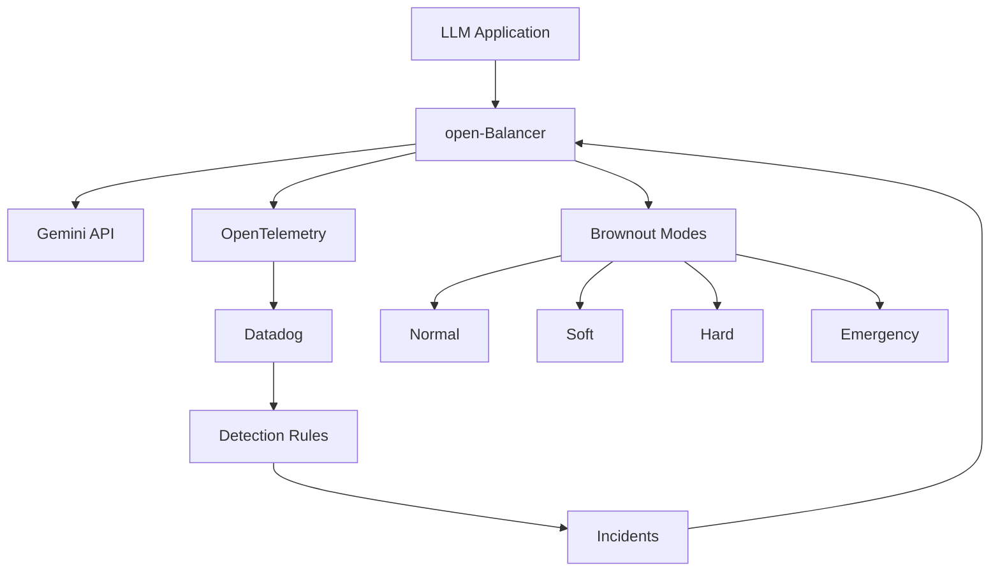

# open-Balancer

[](https://opensource.org/licenses/MIT)
[](https://typescriptlang.org/)
[](https://nextjs.org/)
[](https://cloud.google.com/)
[](https://www.datadoghq.com/)

An open-source adaptive control layer for Gemini-powered LLM applications that maintains reliability and cost efficiency under stress.

## 🎯 Overview

open-Balancer brings proven SRE "brownout" principles to AI systems, automatically applying adaptive strategies when your LLM applications face stress. Using real-time signals from Datadog, it gracefully reduces response complexity when latency, error rates, or token costs spike—keeping applications responsive instead of failing.

### Key Benefits

- **🔄 Real-time Adaptation**: Automatically adjusts LLM behavior based on live monitoring signals
- **💰 Cost Control**: Reduces token usage when costs spike, maintaining budget predictability  
- **🛡️ Reliability First**: Prevents sudden degradation with graceful brownout strategies
- **📊 Deep Observability**: Built-in integration with Datadog for comprehensive monitoring
- **☁️ Cloud Native**: Optimized for Google Cloud Platform with OpenTelemetry instrumentation
- **🎛️ Lightweight Console**: Monitor health, test behavior, and trace incidents

## 🏗️ Architecture



### Brownout Modes

1. **Normal Mode**: Full LLM capabilities, complex responses
2. **Soft Mode**: Slightly reduced complexity, faster responses
3. **Hard Mode**: Simplified responses, essential features only
4. **Emergency Mode**: Minimal responses, maximum reliability

## 🚀 Quick Start

### Prerequisites

- Node.js 18+ and npm
- Google Cloud Platform account
- Datadog account and API key
- Gemini API access

### Installation

1. **Clone the repository**
   ```bash
   git clone https://github.com/your-org/open-balancer.git
   cd open-balancer
   ```

2. **Install dependencies**
   ```bash
   npm install
   ```

3. **Set up environment variables**
   ```bash
   cp .env.example .env.local
   # Edit .env.local with your configuration
   ```

4. **Run the development server**
   ```bash
   npm run dev
   ```

5. **Open the console**
   Navigate to [http://localhost:3000/console/dashboard](http://localhost:3000/console/dashboard)

### Environment Configuration

```bash
# Google Cloud
GOOGLE_CLOUD_PROJECT=your-project-id
GOOGLE_APPLICATION_CREDENTIALS=path/to/service-account.json

# Gemini API
GEMINI_API_KEY=your-gemini-api-key

# Datadog
DATADOG_API_KEY=your-datadog-api-key
DATADOG_APP_KEY=your-datadog-app-key
DATADOG_SITE=datadoghq.com

# OpenTelemetry
OTEL_EXPORTER_OTLP_ENDPOINT=https://api.datadoghq.com
OTEL_SERVICE_NAME=open-balancer
```

## 📁 Project Structure

```
open-balancer/
├── src/
│   ├── app/                    # Next.js App Router
│   │   ├── site/              # Marketing website
│   │   ├── auth/              # Authentication pages
│   │   ├── console/           # Admin console
│   │   └── legal/             # Legal pages
│   ├── components/            # React components
│   │   ├── ui/               # shadcn/ui components
│   │   ├── site/             # Site components
│   │   ├── console/          # Console components
│   │   └── app/              # Shared components
│   ├── lib/                  # Utilities and configurations
│   └── types/                # TypeScript type definitions
├── docs/                     # Documentation
├── scripts/                  # Build and deployment scripts
└── tests/                    # Test files
```

## 🎛️ Console Features

### Dashboard
- Real-time monitoring of LLM applications
- Brownout event tracking
- Token usage and cost metrics
- System health indicators

### Brownout Management
- Configure brownout thresholds
- Monitor brownout history
- Test different brownout modes
- Performance impact analysis

### Incident Management
- Track and manage system incidents
- Automated incident creation from Datadog
- Response procedures and escalation
- Post-incident analysis

### Observability
- Metrics, logs, and traces visualization
- Performance monitoring
- Error rate tracking
- Custom dashboards

## 🔧 Configuration

### Brownout Thresholds

Configure when brownout modes activate:

```yaml
# config/brownout.yaml
thresholds:
  soft:
    latency_p95: 2000ms
    error_rate: 5%
    token_cost_per_hour: $50
  hard:
    latency_p95: 5000ms
    error_rate: 10%
    token_cost_per_hour: $100
  emergency:
    latency_p95: 10000ms
    error_rate: 20%
    token_cost_per_hour: $200
```

### Datadog Integration

Set up detection rules in Datadog:

```json
{
  "name": "LLM High Latency",
  "query": "avg(last_5m):avg:llm.response_time{service:open-balancer} > 2",
  "message": "LLM response time is high @webhook-open-balancer",
  "tags": ["service:open-balancer", "severity:warning"]
}
```

## 🧪 Testing

```bash
# Run all tests
npm test

# Run tests in watch mode
npm run test:watch

# Run integration tests
npm run test:integration

# Run load tests
npm run test:load
```

## 🚢 Deployment

### Google Cloud Run

```bash
# Build and deploy
npm run build
npm run deploy:gcp
```

### Docker

```bash
# Build image
docker build -t open-balancer .

# Run container
docker run -p 3000:3000 open-balancer
```

### Kubernetes

```bash
# Apply manifests
kubectl apply -f k8s/
```

## 📊 Monitoring

### Key Metrics

- **Response Time**: P50, P95, P99 latencies
- **Error Rate**: 4xx and 5xx error percentages
- **Token Usage**: Tokens per request, cost per hour
- **Brownout Events**: Frequency and duration
- **Model Performance**: Accuracy and relevance scores

### Alerts

Set up alerts for:
- High error rates (>5%)
- Increased latency (P95 >2s)
- Cost spikes (>$100/hour)
- Brownout activations
- System failures

## 🤝 Contributing

We welcome contributions! Please see our [Contributing Guide](CONTRIBUTING.md) for details.

### Development Workflow

1. Fork the repository
2. Create a feature branch (`git checkout -b feature/amazing-feature`)
3. Make your changes
4. Add tests for new functionality
5. Ensure all tests pass (`npm test`)
6. Commit your changes (`git commit -m 'Add amazing feature'`)
7. Push to the branch (`git push origin feature/amazing-feature`)
8. Open a Pull Request

## 📄 License

This project is licensed under the MIT License - see the [LICENSE](LICENSE) file for details.

## 🔒 Security

Please report security vulnerabilities to security@open-balancer.org. See our [Security Policy](SECURITY.md) for more information.

## 📞 Support

- **Documentation**: [docs.open-balancer.org](https://docs.open-balancer.org)
- **Issues**: [GitHub Issues](https://github.com/your-org/open-balancer/issues)
- **Discussions**: [GitHub Discussions](https://github.com/your-org/open-balancer/discussions)
- **Email**: support@open-balancer.org

## 🗺️ Roadmap

- [ ] Multi-model support (Claude, GPT-4, etc.)
- [ ] Advanced cost optimization algorithms
- [ ] Custom brownout strategies
- [ ] Kubernetes operator
- [ ] Terraform modules
- [ ] Grafana dashboards
- [ ] Slack/Teams integrations

## 🙏 Acknowledgments

- [Datadog](https://www.datadoghq.com/) for observability platform
- [Google Cloud](https://cloud.google.com/) for infrastructure
- [OpenTelemetry](https://opentelemetry.io/) for instrumentation
- [Next.js](https://nextjs.org/) for the web framework
- [shadcn/ui](https://ui.shadcn.com/) for UI components

---

**Built with ❤️ for the LLM community**